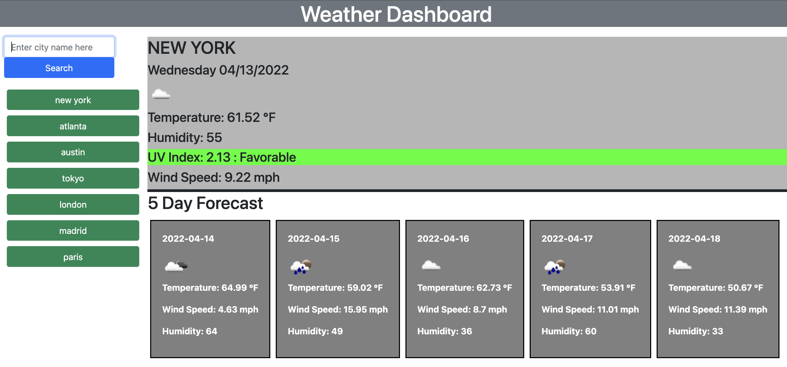

# 06-weather-dashboard

Link to deployed application: https://aalink.github.io/06-weather-dashboard/

```
Preparing for what can be Difficult to Predict
```

We juggle many things in our daily lives, which can sometimes cause us to overlook things that are much simpler.  
"Do I need an umbrella?"  
A very simple question, but if forgotten, it can potentially ruin your day. In this project, a weather dashboard is created to give the user the current weather in addition to a five day forecast. It also keeps track of search history in case the user wishes to quickly revisit the conditions of a recently viewed city.



```
Challenges
```
This project was my introduction to server-side APIs.  As such, it emphasized the importance of learning how to access dynamic data being served from an outside source.  As I had not yet experimented with presenting data from an outside source, it was an exercise of learning how to interface with that data in a new way.
```
What I Learned
```
There were several aspects to this project that were new to me. Understanding API keys and using the proper URL to retrieve the data would be a couple of important examples. However, learning how to properly access JSON data was vital. Retrieving the data is certainly an important first step, but being able to process that data is what allows a developer to present it in a way that is meaningful to the user.
```
Conclusion
```
This has been the most rewarding project so far because it provided an epiphany that gives an understanding of the big picture.  The internet is a vast collection of information.  Exchanging this information between systems can expand the way it can be presented to us.  Server-side APIs are a crucial building block of this complex collection of systems.  The volume of data that is out there would be impossible to make sense of unless it is organized in a standarized format to help us make sense of it. By keeping this seemingly limitless data easily accessible, we can likewise create applications to present it in limitless ways.